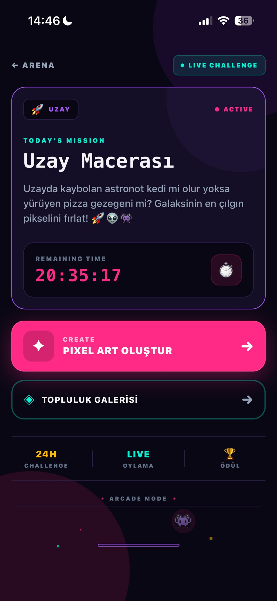
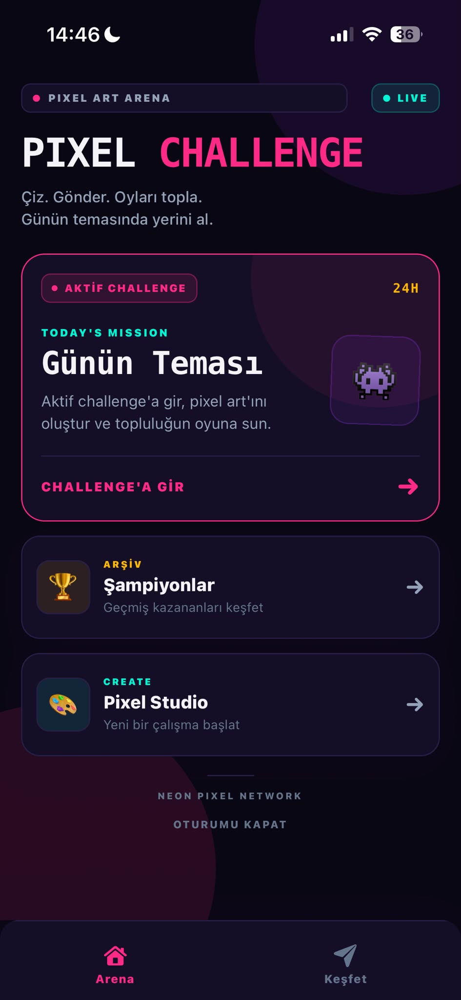
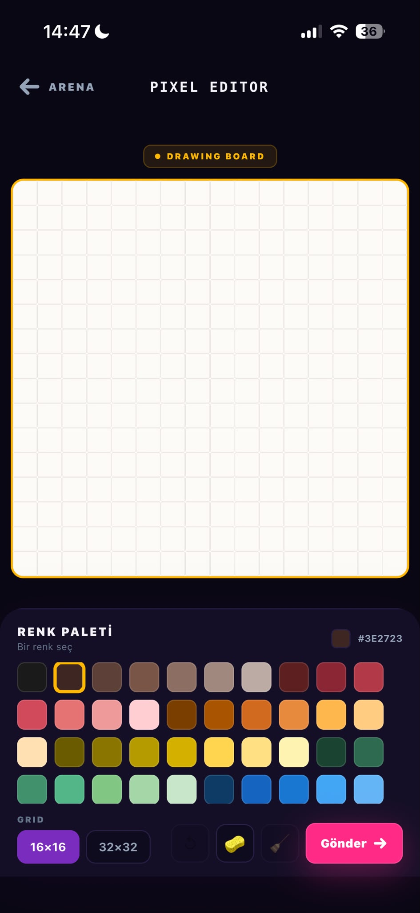

<div align="center">


# 👾 Pixel Art Challenge

**Real-time Themed Pixel Art Arena & Autonomous Voting Platform**

[](https://reactnative.dev/)
[](https://expo.dev/)
[](https://www.typescriptlang.org/)
[](https://firebase.google.com/)
[](https://opensource.org/licenses/MIT)

<p align="center">
  Mobil kullanıcıların tematik yarışmalara katılıp piksel sanatı çizdiği, canlı topluluk oylamasıyla şampiyonların belirlendiği retro-modern mobil platform.
</p>

</div>

```bash
# Hızlı Kurulum & Başlatma (Quickstart)
git clone [https://github.com/begumaLakus/pixel-art-challenge.git](https://github.com/begumaLakus/pixel-art-challenge.git)
cd pixel-art-challenge
npm install
cp .env.example .env
npx expo start
```

## 📱 Screenshots & UI

<div align="center">
  <table>
    <tr>
      <td align="center" width="33%">
        <b>🔐 Kimlik Doğrulama</b><br/><br/>
        
        <br/><em>Giriş, kayıt & oturum yönetimi</em>
      </td>
      <td align="center" width="33%">
        <b>⚡ Canlı Challenge</b><br/><br/>
        
        <br/><em>Günün teması, sayaç & katılım</em>
      </td>
      <td align="center" width="33%">
        <b>🗳️ Pixel Art Sergisi</b><br/><br/>
        
        <br/><em>Topluluk eserleri & canlı oylama</em>
      </td>
    </tr>
  </table>
</div>

---

## ⚡ Hızlı Başlangıç (Getting Started)

### 1. Gereksinimler
- **Node.js**: `v18.x` veya üzeri
- **Paket Yöneticisi**: `npm`, `yarn` veya `pnpm`
- **Geliştirici İstemcisi**: Expo Go uygulaması veya iOS/Android Emülatör

### 2. Ortam Değişkenleri (.env)
Kök dizinde `.env` dosyasını oluşturun ve Firebase kimlik bilgilerinizi tanımlayın:

```env
EXPO_PUBLIC_FIREBASE_API_KEY=your_api_key
EXPO_PUBLIC_FIREBASE_AUTH_DOMAIN=your_auth_domain
EXPO_PUBLIC_FIREBASE_PROJECT_ID=your_project_id
EXPO_PUBLIC_FIREBASE_STORAGE_BUCKET=your_storage_bucket
EXPO_PUBLIC_FIREBASE_MESSAGING_SENDER_ID=your_messaging_sender_id
EXPO_PUBLIC_FIREBASE_APP_ID=your_app_id
```

### 3. Çalıştırma
```bash
# Metro Bundler'ı başlat
npx expo start

# Doğrudan emülatör üzerinde açmak için:
# 'i' tuşuna bas -> iOS Simulator
# 'a' tuşuna bas -> Android Emulator
```

---

## 🛠 Teknoloji Yığını (Tech Stack)

| Katman | Teknoloji | Açıklama |
|---|---|---|
| **Core Framework** | React Native (Expo SDK 51+) | Cross-platform mobil altyapı |
| **Language** | TypeScript | Uçtan uca tip güvenliği ve ölçeklenebilirlik |
| **Routing** | Expo Router | File-based tip kontrollü navigasyon |
| **Backend & Auth** | Firebase Firestore & Auth | Gerçek zamanlı veri senkronizasyonu ve kullanıcı yönetimi |
| **Automation** | Firebase Cloud Functions | Otonom yarışma döngüsü, oy doğrulama & cron tetikleyiciler |

---

## 📐 Teknik Mimari ve Mühendislik Kararları

**1. Pixel Canvas & Render Optimizasyonu (16×16 & 32×32)**
- **Format:** Çizim hücreleri düz/2B matris dizisi olarak tutulur (`Array(size * size)`). Bu yapı JSON depolama maliyetini minimuma indirir.
- **İzolasyon:** Canvas hücreleri re-render yükünü engellemek adına memoize edilmiş bileşen yapısıyla çalışır. 16×16 mobil dokunmatik deneyimi dengelerken 32×32 opsiyonu detaylı çizim alanı sunar.

**2. Otonom Challenge Yaşam Döngüsü**
- **Cron Döngüsü:** Firebase Cloud Functions zamanlayıcısı ile yarışma süresinin bitişi otomatik dinlenir.
- **Otonom Akış:** İstemci tarafı manipülasyonları engellenir; sunucu süreyi denetler, oyları sayar, kazananı `Champions Archive` koleksiyonuna yazar ve yeni temayı anında başlatır.

**3. Güvenli & Otoriter Oylama (Anti-Cheat Voting)**
- **Bütünlük:** Kullanıcıların kendi çizimlerine oy vermesi ve mükerrer oy kullanımı engellenir.
- **Validasyon:** Kurallar yalnızca UI üzerinde değil, Firestore Security Rules ve Cloud Functions üzerinde sunucu seviyesinde denetlenir.

---

## 🔄 Meydan Okuma Akışı (Challenge Flow)

```text
┌───────────────────────────────────────────────┐
│              Aktif Challenge                  │
│       (Canlı Tema & Server Countdown)         │
└──────────────────────┬────────────────────────┘
                       │
                       ▼
┌───────────────────────────────────────────────┐
│            Pixel Studio Çizim                 │
│         (16x16 / 32x32 Dinamik Grid)          │
└──────────────────────┬────────────────────────┘
                       │
                       ▼
┌───────────────────────────────────────────────┐
│          Topluluk Galerisi & Oylama           │
│         (Real-time Sync & Anti-Cheat)         │
└──────────────────────┬────────────────────────┘
                       │
                       ▼
┌───────────────────────────────────────────────┐
│        Cloud Function Cron Tetikleyici        │
│          (Oy Sayımı & Kazanan İlanı)          │
└──────────────────────┬────────────────────────┘
                       │
                       ▼
┌───────────────────────────────────────────────┐
│          Şampiyon Arşive Aktarılır            │
│         Yeni Challenge Otomatik Başlar        │
└──────────────────────┬────────────────────────┘
                       │
                       └────────► [ Yeni Döngü ]
```

---

## 📜 Lisans

Bu proje **MIT** lisansı ile sunulmaktadır.
