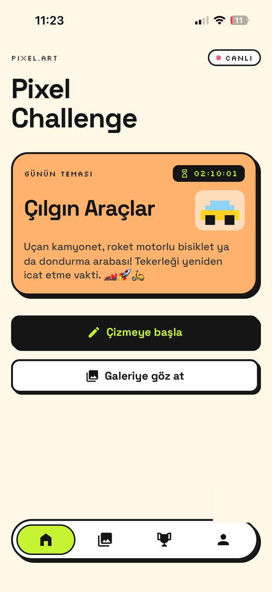
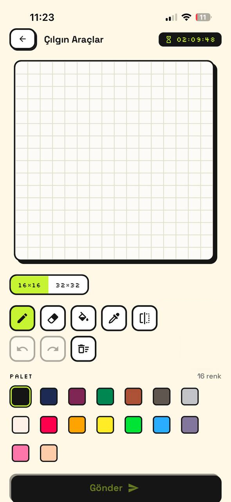
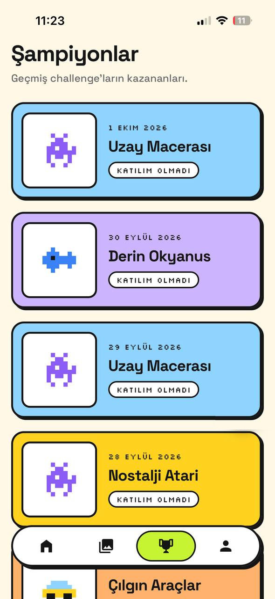
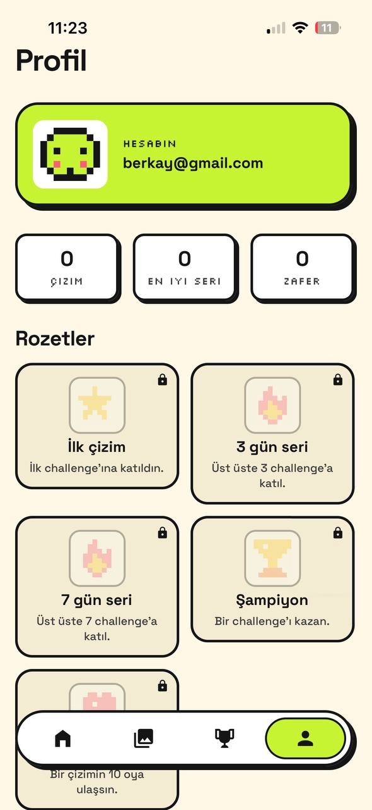

<div align="center">

# 👾 Pixel Art Challenge

**Her gün yeni bir tema, bir piksel tuvali ve topluluk oylaması.**

Kullanıcıların günün temasına göre pixel art çizip gönderdiği, topluluğun oy verdiği ve süre dolunca en çok oyu alanın şampiyon ilan edildiği bir mobil uygulama.

[](https://expo.dev/)
[](https://reactnative.dev/)
[](https://www.typescriptlang.org/)
[](https://firebase.google.com/)

</div>

<div align="center">
  
  
  
  
</div>

---

## Özellikler

**Task gereksinimleri**
1. E-posta ve şifre ile kayıt/giriş (oturum uygulama kapanınca da korunur).
2. Hücre hücre boyayarak çizim editörü: renk paleti, sürükleyerek boyama, 16×16 ve 32×32 tuval.
3. Her zaman tek bir aktif challenge (tema + bitiş zamanı); çizim bu challenge'a gönderilir.
4. Gönderilen çizimleri görme ve oy verme.
5. Süre dolunca en çok oyu alan çizim sunucuda kazanan ilan edilir.
6. Geçmiş challenge'lar ve kazananları "Şampiyonlar" ekranında.

**Ekstralar**
- **Time-lapse:** her çizimin adımları kaydedilir, galeride piksel piksel yeniden oynatılır.
- **Günün paleti:** her challenge 6-7 renkle çizilir (yaratıcı kısıt).
- **Editör araçları:** kalem, silgi, kova, pipet, simetri, geri/ileri al.
- **AI jüri:** her çizime Gemini ile kısa, samimi bir yorum (sunucuda, anahtar istemciye hiç gelmez).
- **AI tema üretimi:** yeni günlük temalar Gemini ile üretilir (başarısız olursa sabit listeye düşer).
- **Seri ve rozetler:** art arda katılım serisi, ilk çizim / 3-7 gün seri / şampiyon / popüler rozetleri.
- **Paylaşım kartı:** çizim hikaye boyutunda (1080×1920) bir görsele çevrilip paylaşılır.
- **Bildirimler:** yeni tema ve kazanma push'u, challenge bitmeden 2 saat önce yerel hatırlatma.
- **Moderasyon (App Store 1.2):** çizim şikayeti, kullanıcı engelleme, hesap silme.

---

## Hızlı başlangıç

```bash
git clone https://github.com/begumaLakus/pixel-art-challenge.git
cd pixel-art-challenge
npm install
cp .env.example .env   # Firebase bilgilerini doldur
npx expo start
```

### Ortam değişkenleri (`.env`)

| Değişken | Açıklama |
|---|---|
| `EXPO_PUBLIC_FIREBASE_*` | Firebase web uygulaması ayarları (API key, auth domain, project id, storage bucket, sender id, app id) |
| `EXPO_PUBLIC_SUPPORT_EMAIL`, `EXPO_PUBLIC_PRIVACY_URL`, `EXPO_PUBLIC_TERMS_URL` | Profil ekranındaki destek ve yasal bağlantılar (boşsa gizlenir) |
| `EXPO_PUBLIC_EMULATOR_HOST` | Sadece emülatör modunda, fiziksel cihaz için bilgisayarın yerel IP'si |

`.env` git'e girmez. Cloud Functions için Gemini anahtarı **istemcide değil**, Secret Manager'da tutulur:

```bash
firebase functions:secrets:set GEMINI_API_KEY
```

### Yerel geliştirme (canlı projeye dokunmadan)

Auth + Firestore emülatörleri ve örnek veriyle çalışır (Java 21+ gerekir):

```bash
npm run emulators        # 1. terminal
npm run seed             # örnek challenge, çizim ve test kullanıcısı (bkz. scripts/seed-emulator.mjs)
npm run start:emulator   # 2. terminal, uygulamayı emülatöre bağlar (-- --web ile tarayıcıda)
```

### Dağıtım

```bash
firebase deploy --only firestore:rules,firestore:indexes
firebase deploy --only functions     # önce otomatik derler (predeploy)
```

---

## Teknik kararlar

**Grid boyutu.** Çizim düz bir renk dizisi (`pixels[]`, uzunluk = boyut²) olarak saklanır. 16×16 dokunmatik kullanım için dengeli, 32×32 detay içindir. Sunucu kuralları boyutu 16/32 ile ve dizi uzunluğunu boyutun karesiyle sınırlar. Kayıtlı çizimler satır içinde aynı renkli hücreleri birleştirerek çizilir (az View, akıcı liste).

**Oylama kısıtı.** Bir kullanıcı bir challenge'da **tek oy** kullanır; oy dokümanı `votes/{challengeId}_{uid}` (başka bir oya tıklamak oyu taşır, aynısına tekrar tıklamak geri alır). Kısıtlar istemcide değil **Firestore kurallarında** zorunludur: kendi çizimine oy yok, çizim aynı challenge'a ait olmalı, süre dolmuş challenge'a oy yok. `voteCount` istemci tarafından yazılamaz; `votes` koleksiyonunu baştan sayan bir Cloud Function yazar (tetikleyiciler "en az bir kez" çalıştığı için artımlı sayaç yerine yeniden sayım, yani idempotent).

**Tek gönderi.** Çizim dokümanı `submissions/{challengeId}_{uid}`; kurallar bu kimliği zorunlu kılar, bu yüzden mükerrer gönderim sunucuda da imkânsızdır.

**Challenge yaşam döngüsü.** `manageChallenges` her dakika çalışır: süresi dolan challenge'ı tamamlar, kazananı belirler ve yeni challenge'ı (Gemini'den veya sabit listeden tema + palet) başlatır. Böylece her zaman bir aktif challenge vardır (en fazla ~1 dk boşluk). Süre kontrolü sunucu saatiyle (`request.time`) yapılır; istemci saatine güvenilmez.

**Kazanan.** Oylar `votes` koleksiyonundan doğrudan sayılır; **eşitlikte en erken gönderen kazanır**. Silinmiş çizimlerin artık oyları yok sayılır.

**Güvenlik.** Kurallar `firestore.rules` içinde ve `tests/rules` altında gerçek emülatörde test edilir (her kural, satırı kaldırınca testin kırıldığı doğrulanarak yazıldı).

---

## Testler

```bash
npm test               # istemci birim testleri
npm run test:functions # Cloud Functions testleri
npm run test:rules     # Firestore kuralları (emülatör, Java 21+ gerekir)
npm run typecheck && npm run lint
```

## Proje yapısı

```
app/                  Expo Router rotaları (tabs: Arena, Galeri, Şampiyonlar, Profil; editor; auth)
src/components/ui/    Tasarım sistemi bileşenleri (StickerBox, StickerButton, PixelArt, ...)
src/theme/            Renk, boşluk, font tokenları ve pixel sprite'lar
src/features/         auth · challenges · editor · submission · voting · archive
                      profile · moderation · notifications · share
functions/            Cloud Functions (challenge döngüsü, oy sayımı, AI, push, hesap silme)
firestore.rules       Güvenlik kuralları
tests/rules/          Kural testleri
scripts/              Emülatör tohumlama ve yardımcı betikler
```

## Tasarım

Krem zemin, kalın siyah kontur ve sert (bulanıksız) ofset gölge; günün temasına göre değişen tek bir vurgu rengi. Başlıklar Space Grotesk, etiketler Silkscreen (pixel font). Emoji yerine uygulamanın kendi pixel art maskotu ve sprite'ları kullanılır.

